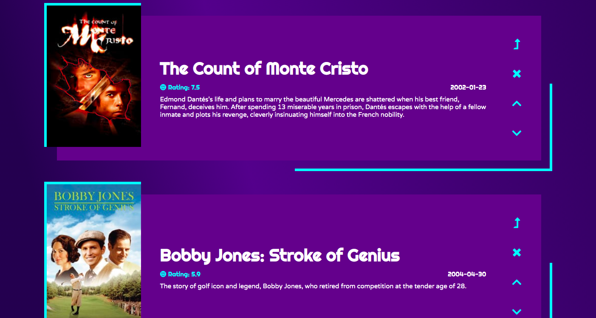

# Movie Playlist Generator

[Movie Playlist Generator on Github Pages](https://lewisbrignell.github.io/moviePlaylistGenerator/)

## What is it?

This project generates movie playlists based on user selected actors and actresses. 

## What's it made with?

Built using Javascript / jQuery and styled with Sass. Data is pulled using Ajax calls to The MovieDB API.

## How does it work?

The user types in a name; first name, last name, full name, whatever. If there's more than one person by that name, up to five can be returned for the user to select. Once selected, a playlist up to ten movies long is generated. Users may rearrange and remove items from the list.
